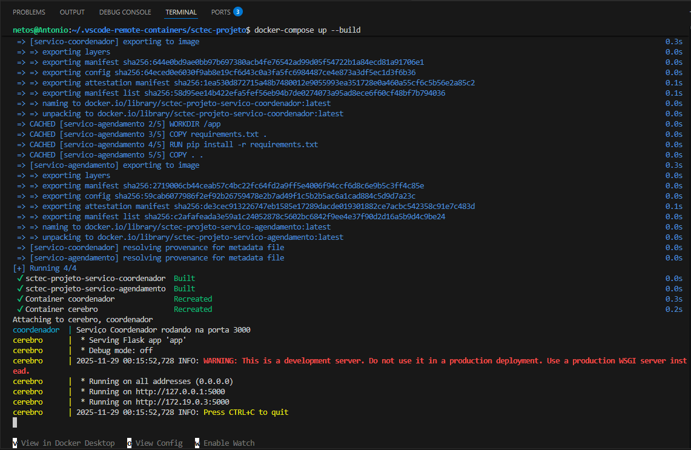
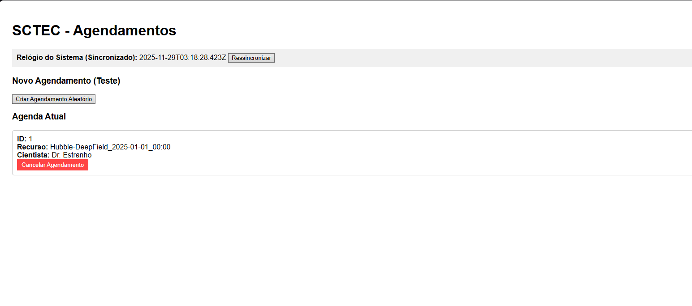
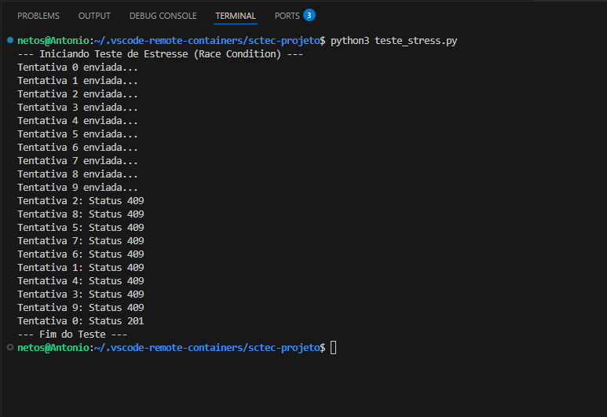
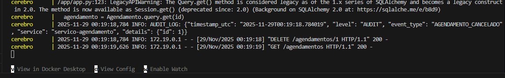

# SCTEC - Sistema de Controle de Telescópio Espacial Compartilhado 

Este repositório contém a implementação do núcleo de um sistema distribuído para agendamento de um telescópio espacial. O projeto foi desenvolvido como parte da disciplina de Computação Distribuída, com foco em resolução de **condições de corrida**, **exclusão mútua**, **sincronização de relógios** e **orquestração de microserviços**.

## Sobre o Projeto

O desafio consiste em garantir que cientistas ao redor do mundo possam agendar horários de observação em um telescópio compartilhado sem conflitos, mesmo em um ambiente de alta concorrência. 

O sistema resolve três problemas principais de sistemas distribuídos:
1.  **Condição de Corrida (Race Conditions):** Múltiplos usuários tentando reservar o mesmo horário simultaneamente.
2.  **Sincronização de Relógios:** Garantia de justiça no agendamento independente do relógio local do usuário (uso do Algoritmo de Cristian).
3.  **Auditoria e Rastreabilidade:** Logs estruturados e imutáveis para validar operações.

## Tecnologias Utilizadas

* **Python 3.9+ (Flask):** API Principal ("Cérebro") responsável pela regra de negócio e persistência.
* **Node.js 18+ (Express):** Serviço Coordenador ("Porteiro") responsável pelo gerenciamento de *Locks* (travas) e exclusão mútua.
* **Docker & Docker Compose:** Para containerização e orquestração dos serviços.
* **SQLite:** Banco de dados relacional.
* **HTML5/JavaScript:** Frontend para teste de sincronização de tempo e HATEOAS.

---

## Arquitetura Implementada

O sistema opera com dois microserviços colaborativos:

### 1. Serviço de Agendamento (Python/Flask)
Atua como a fonte da verdade. Ele recebe as requisições, valida os dados e implementa **HATEOAS** (Hypermedia as the Engine of Application State). Antes de salvar qualquer dado, ele consulta o Coordenador.

### 2. Serviço Coordenador (Node.js)
Um serviço leve e de alta performance que gerencia uma tabela de *locks* em memória. Ele garante que apenas um processo por vez possa obter permissão de escrita para um determinado recurso/horário.

---

## Relatório de Execução e Testes

Abaixo estão as evidências do funcionamento do sistema, demonstrando a robustez contra falhas de concorrência.

### 1. Inicialização do Ambiente (Docker)
O comando `docker-compose up --build` inicia os dois contêineres e estabelece a rede entre eles.


*(Descrição: Print do terminal mostrando os logs iniciais do Flask e do Node.js subindo via Docker Compose)*

### 2. Interface do Usuário e Sincronização de Tempo
O frontend implementa o **Algoritmo de Cristian**. O cliente solicita a hora ao servidor, calcula a latência (RTT) e ajusta seu relógio local para exibir o horário preciso do servidor.


*(Descrição: Print da tela localhost:5000 mostrando o horário do servidor sincronizado e a lista de agendamentos)*

### 3. Prova de Exclusão Mútua (Race Condition)
Foi executado um script de **Teste de Estresse** disparando 10 requisições simultâneas para o mesmo horário. 
* **Resultado Esperado:** Apenas 1 requisição retorna `201 Created`. As outras 9 retornam `409 Conflict`.
* **Log do Coordenador:** Mostra 1 *Lock* concedido e vários negados.


*(Descrição: Print mostrando o terminal do script de teste com os erros 409)*

### 4. Logs de Auditoria e Cancelamento
O sistema gera logs estruturados (JSON) para operações críticas. Abaixo, a evidência de um cancelamento realizado via HATEOAS.


*(Descrição: Print do terminal focando nas linhas que contêm "AUDIT_LOG", mostrando "AGENDAMENTO_CRIADO" e "AGENDAMENTO_CANCELADO")*

---

## 🔧 Como Rodar o Projeto

### Pré-requisitos
* Docker e Docker Desktop instalados.

### Passo a Passo
1.  Clone o repositório:
    ```bash
    git clone [https://github.com/seu-usuario/seu-repositorio.git](https://github.com/seu-usuario/seu-repositorio.git)
    cd sctec-projeto
    ```

2.  Suba os serviços:
    ```bash
    docker-compose up --build
    ```

3.  Acesse a aplicação:
    * Frontend: [http://localhost:5000](http://localhost:5000)
    * API Flask: porta 5000
    * Coordenador Node: porta 3000

4.  (Opcional) Rode o teste de estresse (requer Python local):
    ```bash
    python3 teste_stress.py
    ```

---

## Grupo:
* Antonio Carlos Sciamarelli Neto - 10409160
* Gustavo Matta - 10410154
